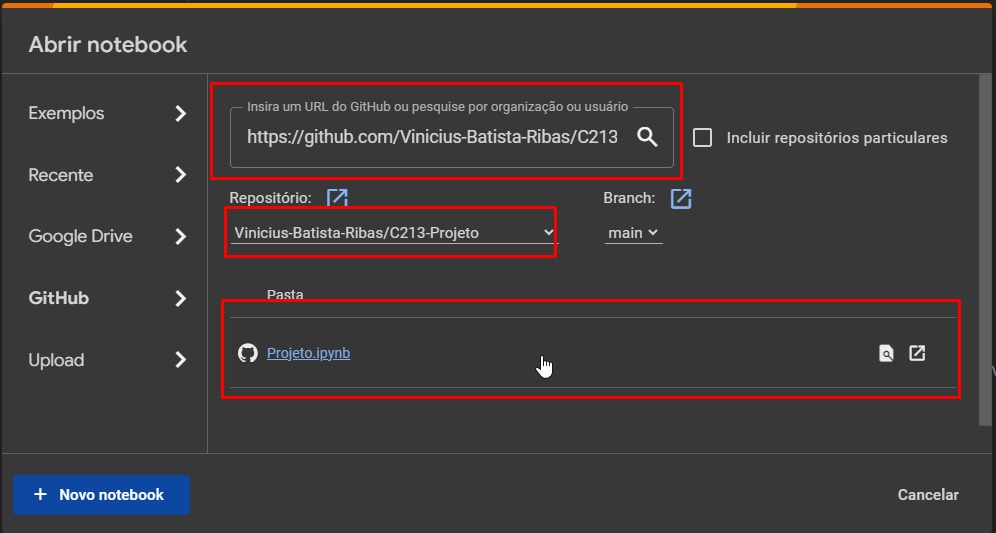

# Projeto C213: Identificação e Controle de Sistemas

## Objetivo

Este projeto tem como objetivo realizar a identificação e análise de sistemas de controle de primeira ordem a partir de dados experimentais. Além disso, implementa e compara duas estratégias de controle: IMC (Internal Model Control) e ITAE (Integral Time Absolute Error) para o sistema identificado.

## Conteúdos Estudados

- Identificação de sistemas de primeira ordem a partir de dados experimentais.
- Implementação de controladores PID (Proporcional-Integral-Derivativo) usando as estratégias IMC e ITAE.
- Análise de desempenho de sistemas de controle (tempo de subida, tempo de acomodação e overshoot).

## Membros

- Joyce da Costa Dias
- Vinicius Batista Ribas
- Gabriel Costa Duarte da Silva

## Bibliotecas e Frameworks

- Numpy
- Matplotlib
- Control
- Google Colab

## Requisitos

- Acesso ao Google Colab.
- Python 3.x
- Bibliotecas: `numpy`, `scipy`, `control`, `matplotlib`

## Como Usar

1. Acesse o site do Google Colab.
2. Faça login na sua conta do Google.
3. Baixe o dataset.
4. Baixe o arquivo "Projeto.ipynb".
5. Abra o Google Colab e importe o arquivo "Projeto.ipynb".

**Observação:** Você também pode abrir o arquivo diretamente a partir do repositório. Para isso, clique na aba "GitHub" no Google Colab e cole o link do repositório GitHub que deseja abrir. Em seguida, escolha o repositório chamado "C213-Projeto" e selecione o arquivo "Projeto.ipynb".

## Observação

Certifique-se de ter os arquivos de dados e o código na mesma pasta antes de executar o código.
